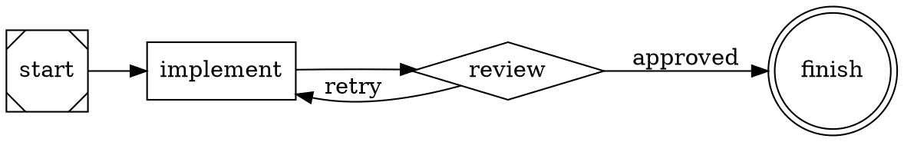
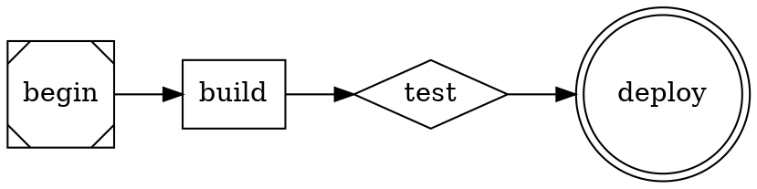

# Postmortem: check_e2e (01KJRF75H261FMFY4YR1A3HCNY)

## Summary

The `check_e2e` node failed because `pnpm test:e2e` crashes immediately with `Cannot find module './tests/global-setup.ts'` — the entire `frontend/tests/` directory contains no test files; only an empty `utils/` subdirectory exists. The Playwright config (`playwright.config.ts`) references `globalSetup: "./tests/global-setup.ts"` but that file was never created, along with all required spec files.

---

## Failure Mode Classification

**E2E test infrastructure missing** — The `frontend/tests/` directory is completely empty (only `tests/utils/` exists, also empty). Playwright cannot even start because `globalSetup` points to a file that doesn't exist. No spec tests were written at all.

---

## Evidence

### Exact error

```
Error: Cannot find module './tests/global-setup.ts'
Require stack:
- .../node_modules/.pnpm/playwright@1.58.2/node_modules/playwright/lib/common/config.js
...
  code: 'MODULE_NOT_FOUND'
```

### Directory state

```
frontend/tests/
└── utils/        ← empty directory

frontend/playwright.config.ts  ← references ./tests/global-setup.ts (LINE 20)
```

### What's working (do NOT change)

All other gates pass:

| Gate | Status |
|------|--------|
| `cargo fmt --check` | ✅ PASS |
| `cargo clippy -- -D warnings` | ✅ PASS |
| `cargo build` | ✅ PASS |
| `cargo test` | ✅ PASS |
| `pnpm install --frozen-lockfile` | ✅ PASS |
| `pnpm build` | ✅ PASS (tsc + vite succeed) |
| `pnpm lint` | ✅ PASS |
| `pnpm test:unit` | ✅ PASS |
| `npx tsc --noEmit` | ✅ PASS |
| `pnpm test:e2e` | ❌ FAIL — missing global-setup.ts |

The Rust server binary builds and passes all 52+ unit + integration tests. The `server/assets/` directory is populated with the Vite build output. Playwright v1.58.2 is installed in `node_modules`.

---

## Root Cause Analysis

The `implement` node was executed as a repair iteration focused on fixing the TypeScript type mismatch (`checkPipelineLiveness` signature). That fix succeeded (tsc now passes). However, the E2E test layer (`frontend/tests/`) was never created in any prior iteration — it was overlooked because earlier iterations only ran up through `check_tests`, not `check_e2e`.

The required test files per `specification/intent/server.md` Section 3.3 and `specification/constraints/testing-requirements.md` Section 12.3:

```
frontend/tests/
├── fixtures.ts              ← Playwright test fixtures (extends test with server spawning)
├── global-setup.ts          ← Build Rust server before tests
├── utils/
│   ├── server.ts            ← Spawn/stop Rust server subprocess
│   └── assertions.ts        ← Reusable page assertions
├── graph-rendering.spec.ts
├── status-overlay.spec.ts
├── detail-panel.spec.ts
├── connection-handling.spec.ts
└── server-startup.spec.ts
```

None of these files exist except the empty `utils/` directory stub.

---

## Repair Guidance

### Files to CREATE (all in `frontend/tests/`)

**Priority 1 — Unblock Playwright startup:**

#### `frontend/tests/global-setup.ts`
This is what Playwright loads before any tests. It should build the Rust server binary so it's available for tests.

```typescript
import { execSync } from "child_process";
import path from "path";

async function globalSetup() {
  const repoRoot = path.resolve(__dirname, "../../");
  console.log("Building Rust server for E2E tests...");
  execSync("cargo build", {
    cwd: path.join(repoRoot, "server"),
    stdio: "inherit",
  });
  console.log("Rust server build complete.");
}

export default globalSetup;
```

**Priority 2 — Test utilities:**

#### `frontend/tests/utils/server.ts`
Spawns/stops the Rust server as a child process for each test:

```typescript
import { ChildProcess, spawn } from "child_process";
import path from "path";
import net from "net";

const SERVER_BINARY = path.resolve(
  __dirname,
  "../../../server/target/debug/cxdb-graph-ui"
);

export async function waitForPort(port: number, timeout = 10000): Promise<void> {
  const start = Date.now();
  while (Date.now() - start < timeout) {
    try {
      await new Promise<void>((resolve, reject) => {
        const socket = net.connect(port, "127.0.0.1");
        socket.on("connect", () => { socket.destroy(); resolve(); });
        socket.on("error", reject);
      });
      return;
    } catch {
      await new Promise(r => setTimeout(r, 100));
    }
  }
  throw new Error(`Port ${port} not ready after ${timeout}ms`);
}

export async function startServer(args: string[], port = 9030): Promise<ChildProcess> {
  const proc = spawn(SERVER_BINARY, ["--port", String(port), ...args], {
    stdio: ["ignore", "pipe", "pipe"],
  });
  await waitForPort(port);
  return proc;
}

export function stopServer(proc: ChildProcess): void {
  proc.kill("SIGTERM");
}
```

#### `frontend/tests/utils/assertions.ts`
Reusable assertions for page checks:

```typescript
import { Page, expect } from "@playwright/test";

export async function expectSvgRendered(page: Page): Promise<void> {
  await expect(page.locator("svg")).toBeVisible({ timeout: 15000 });
}

export async function expectTabVisible(page: Page, label: string): Promise<void> {
  await expect(page.locator(`[data-testid="tab-bar"]`)).toContainText(label);
}
```

#### `frontend/tests/fixtures.ts`
Custom Playwright fixtures that extend `test` with server lifecycle:

```typescript
import { test as base, Page } from "@playwright/test";
import { ChildProcess } from "child_process";
import path from "path";
import { startServer, stopServer } from "./utils/server";

export type ServerFixture = {
  serverProcess: ChildProcess;
};

const FIXTURES_DIR = path.resolve(__dirname, "../../server/tests/fixtures");

export const test = base.extend<ServerFixture>({
  serverProcess: async ({}, use) => {
    const dotPath = path.join(FIXTURES_DIR, "simple-pipeline.dot");
    const proc = await startServer(["--dot", dotPath]);
    await use(proc);
    stopServer(proc);
    await new Promise(r => setTimeout(r, 200)); // let port free
  },
});

export { expect } from "@playwright/test";
```

**Priority 3 — Spec files (minimum viable for `pnpm test:e2e` to pass):**

#### `frontend/tests/graph-rendering.spec.ts`
Tests: SVG renders, tab labels match graph IDs, DOT loads correctly.

Key checks per spec Section 12.3:
- Application loads and WASM initializes within 15s
- `<svg>` element exists with nodes for each pipeline node
- Tab bar renders with correct graph ID
- `data-testid="graph-area"` present
- `data-testid="tab-bar"` present
- Node click opens detail panel (`data-testid="detail-panel"`)

#### `frontend/tests/status-overlay.spec.ts`
Tests: Node colors match expected status when CXDB returns mock data.

Key checks:
- `page.route("/api/cxdb/*", ...)` intercepts CXDB calls and returns fixture JSON
- Pending nodes have class `status-pending` (gray)
- Running nodes have class `status-running` (blue/pulse)
- Complete nodes have class `status-complete` (green)
- Error nodes have class `status-error` (red)
- `data-testid="connection-indicator"` present

#### `frontend/tests/detail-panel.spec.ts`
Tests: Clicking a node opens the detail panel, panel shows node info, closes on button click.

Key checks:
- Before click: `data-testid="detail-panel"` not visible
- After click: panel is visible with node ID and type
- Close button hides panel
- `data-testid="turn-row-{turnId}"` present when turns exist

#### `frontend/tests/connection-handling.spec.ts`
Tests: CXDB unreachable → message displayed; graph still renders.

Key checks:
- When CXDB returns 503, graph still renders
- `data-testid="connection-indicator"` shows offline state
- `data-testid="error-message"` may appear

#### `frontend/tests/server-startup.spec.ts`
Tests: Server CLI validation via Bash subprocess (no browser needed).

Key checks (per spec Section 12.3):
- No `--dot` flag → exits non-zero with usage message
- Duplicate basenames → exits non-zero with "duplicate basename" error
- Anonymous graph (no `digraph <id>`) → exits non-zero
- Valid invocation → starts successfully (port responds)

**NOTE:** These tests use `execSync` / `spawnSync` from Node.js, not Playwright's browser. They should use `test` from `@playwright/test` but `test.skip` the browser parts or run as "api" tests with no page fixture needed.

### DOT fixture files required

The E2E tests need fixture DOT files. Create them in `server/tests/fixtures/` (already used by Rust integration tests, if that directory exists, or create it):

#### `server/tests/fixtures/simple-pipeline.dot`


#### `server/tests/fixtures/multi-tab-b.dot`


### Check if fixtures directory exists

```bash
ls server/tests/fixtures/ 2>/dev/null || mkdir -p server/tests/fixtures/
```

---

## What NOT to Change

- **Do NOT modify `frontend/playwright.config.ts`** — it correctly points to `./tests/global-setup.ts`; the file just needs to be created.
- **Do NOT modify `frontend/src/`** — all React components, hooks, lib, and types are working.
- **Do NOT modify `server/src/`** — all Rust source is correct and tests pass.
- **Do NOT modify `server/Cargo.toml`** — all dependencies are present.
- **Do NOT modify `frontend/package.json`** — `@playwright/test` is already a devDependency.
- **Do NOT modify `frontend/vitest.config.ts`** or any unit test files — all 82 unit tests pass.
- **Do NOT run `pnpm install`** — `node_modules/` is already populated.
- **Do NOT re-run `pnpm build`** — `server/assets/` already contains valid build output.

---

## Implementation Strategy for the Repair

The repair is straightforward: create the missing files in `frontend/tests/`. The key constraint is that tests must be able to pass in a local environment without a live CXDB instance (mock via `page.route()`).

**Server binary path:** The test utils should use `../../../server/target/debug/cxdb-graph-ui` (relative to `frontend/tests/utils/`) which is built by `global-setup.ts`.

**Port management:** Use port 9031+ for tests to avoid conflicts with any development server on 9030. Or kill any existing process on 9030 before spawning.

**WASM timeout:** Graphviz WASM can take 2-5 seconds to initialize. Use `timeout: 15000` for SVG assertions.

**Minimum viable test suite:** The highest priority is getting `pnpm test:e2e` to pass. A minimal suite with one passing test per spec file is sufficient. Do not write exhaustive tests — write enough to satisfy the spec's E2E coverage requirements.

---

## Verification

After the fix:

```bash
# From frontend/
pnpm test:e2e
# Expected: All spec files found and executed
# Expected: global-setup.ts runs cargo build successfully
# Expected: All tests pass

# If server binary not found:
cd server && cargo build
cd ../frontend && pnpm test:e2e

# Quick smoke check (no browser needed):
ls frontend/tests/global-setup.ts    # must exist
ls frontend/tests/fixtures.ts         # must exist
ls frontend/tests/utils/server.ts     # must exist
ls frontend/tests/utils/assertions.ts # must exist
ls frontend/tests/graph-rendering.spec.ts    # must exist
ls frontend/tests/status-overlay.spec.ts     # must exist
ls frontend/tests/detail-panel.spec.ts       # must exist
ls frontend/tests/connection-handling.spec.ts # must exist
ls frontend/tests/server-startup.spec.ts     # must exist
```

All existing gates must still pass after the fix:

```bash
cargo fmt --check        # from server/
cargo clippy -- -D warnings  # from server/
cargo test               # from server/
pnpm lint                # from frontend/
pnpm test:unit           # from frontend/
pnpm build               # from frontend/
```
