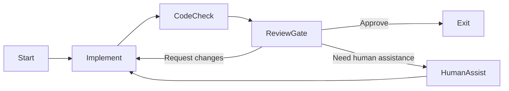
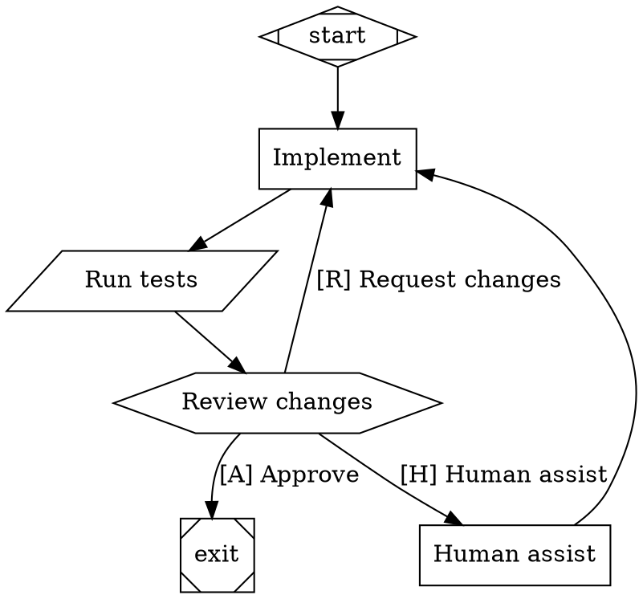
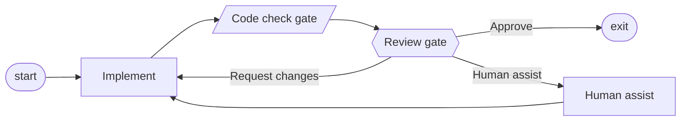
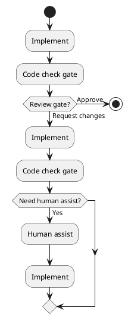
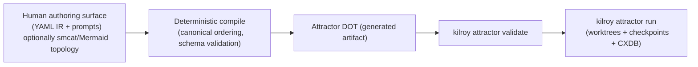

# Human-Readable and Maintainable Abstractions over Graphviz DOT for Gated Workflows

## Executive summary

A practical “workflow-as-graph” model for software-factory pipelines (code checks, human reviews, loops, and escalation paths) already exists in entity["company","strongDM","developer access platform"]’s Attractor specification and the entity["people","Dan Shapiro","software engineer"] Kilroy implementation: the pipeline is a directed graph defined in a constrained subset of Graphviz DOT, and **execution is deterministic** via a specified edge-selection algorithm, explicit node-handler types, retry policy, and goal-gate enforcement. citeturn28view0turn14view0turn14view3 This is directly aligned with the user’s constructs: code check gates map cleanly to “tool” nodes, review gates to “wait.human” nodes (hexagon), loop-backs to ordinary back-edges, and “human assistance” to an explicit branch from a human gate or conditional. citeturn28view0

Your current approach (as documented in `docs/software-factory.md` and implemented by your Ruby scripts) is *already* the right architectural shape for “human-readable DOT authoring”: you maintain a **version-controlled YAML + prompt files** source-of-truth, deterministically compile to DOT, then validate and run with Kilroy. citeturn26view0turn11view0turn14view0 This splits (a) graph topology + execution metadata (YAML) from (b) long human instructions (markdown prompts), which directly targets DOT’s main maintainability pain: large quoted strings and repeated attribute boilerplate. citeturn26view0turn11view0turn28view0

Prior art falls into three buckets with different tradeoffs:

* **Diagram-as-code DSLs** (Mermaid, PlantUML, state-machine-cat) optimize readability for humans and review diffs, but need an annotation strategy to carry Attractor/Kilroy execution metadata (node type, prompt file, tool command, retries, etc.). citeturn15search4turn20view2turn22view0  
* **Workflow runtime DSLs** (GitHub Actions, GitLab CI, Argo Workflows, Airflow, Step Functions) provide rich operational tooling and validation **but most enforce DAGs** (no general cycles) or don’t model “send back” loops natively; loops become “re-run / retry / iterate items” rather than explicit back-edges. citeturn18search1turn23search0turn16search10turn16search3  
* **Formal state machine/process standards** (SCXML, BPMN, Petri nets/PNML, XState) have strong semantics and tooling, but their canonical serialization formats (XML/JSON) can be verbose and tend to require either (a) a heavier runtime adoption or (b) a bespoke compilation step to the Attractor DOT subset. citeturn19search0turn25search0turn19search3turn20view0  

Best-fit options for your stated goal (“easy human-readable + maintainable abstractions *to represent DOT* for simple generic gated workflows”) are:

* **Keep the current YAML+prompts model as the canonical DSL**, and harden it into a reusable “Attractor pipeline schema” (JSON Schema, validation/linting, library support). This is the lowest-risk, highest determinism, and best-integrated with Kilroy. citeturn26view0turn11view0turn28view0  
* Add a **diagram-as-code front-end** for topology only—especially **state-machine-cat (smcat)**—because it explicitly exists to avoid writing DOT, can output DOT/SCXML/JSON AST, and already positions itself as a Graphviz DOT abstraction layer. citeturn22view0turn22view1  
* If you want a widely-known structured workflow spec with explicit human wait semantics, consider a hybrid with **AWS Step Functions’ Amazon States Language** (ASL) as an alternate IR; it has first-class Choice/Task transitions and durable “wait for callback with task token” (often used for approvals). Migration is higher because execution semantics and artifacts differ from Kilroy, but the spec is highly deterministic and tooling is strong. citeturn16search3turn16search7  
* If Kubernetes-native operation is a priority, **Argo Workflows** is the strongest YAML-based runtime with pause/resume (“suspend”), DAG dependencies, conditionals, and loop constructs—however, it largely treats workflows as DAGs + iteration rather than arbitrary cyclic graphs, so “send back for more work” becomes a different pattern. citeturn23search0turn16search0turn23search1  

Recommended path: **hybrid**—keep Kilroy/Attractor as the execution backend (DOT remains the executable artifact), formalize your YAML DSL as an intermediate representation (IR), and optionally add a “nice topology authoring” layer (smcat or Mermaid) that compiles into the IR and then into Attractor DOT with byte-for-byte determinism checks. citeturn26view0turn11view0turn28view0turn22view0

## Problem framing and evaluation criteria

### Baseline requirements inferred from your description

You want a human-editable abstraction over Graphviz DOT for **simple and generic** workflows that include:

* **Code check gates** (deterministic tooling / objective checks): e.g., test suite, format/lint, build. citeturn26view0turn28view0  
* **Review gates** (human or human-like independent reviewers): approve/reject outcomes driving routing. citeturn26view0turn28view0  
* **Loop-backs** (“send back for more work”): route from failed check/review back to implement. citeturn26view0turn28view0  
* **Branches for human assistance**: explicit escalation path when automation/agents are stuck. citeturn28view0turn26view0  

Your docs also describe a **three-tier validation model**: deterministic tool gates, multi-agent LLM review with an approval threshold, and a postmortem that loops back into plan/implement on failure. citeturn26view0

Target runtime is **unspecified** (you explicitly said there are no constraints), so the report distinguishes:
* **authoring DSLs that compile to Attractor/Kilroy DOT** (low migration if you keep Kilroy), vs.
* **full workflow systems that replace execution** (higher migration; different operational model). citeturn26view0turn14view0turn28view0

### Evaluation dimensions

This report scores candidates on:

**Human readability**: Can a reviewer infer the workflow structure (and key gate semantics) by reading diffs? Is it compact? Does it avoid boilerplate? citeturn28view0turn22view0  

**Human maintainability**: Does it encourage modularity (e.g., prompts in separate files), stable diffs, and refactor-safe identifiers? Is it resilient to “editor reformat churn”? citeturn26view0turn11view0  

**Determinism for generation**: Can it be compiled deterministically into DOT (or a stable IR) without layout noise? Are semantics specified (routing, retries, timeouts)? citeturn28view0turn11view0turn14view3  

**Expressiveness**: Can it represent gates, reviews, loop-backs, and human-assist branches without awkward workaround patterns? citeturn28view0turn16search7turn23search0  

**Tool support**: Editors, validators/linters, renderers, visualizers, and ecosystem maturity. citeturn18search3turn17search2turn19search2turn16search0  

**Integration with DOT**: How direct is compilation to Graphviz DOT and, more specifically, to Attractor’s constrained DOT subset (typed attributes, node shapes → handler types). citeturn28view0turn22view0turn22view1  

**Migration effort from your custom YAML**: Roughly, how much of your current model (nodes + edges + gates + prompt files) can be retained? citeturn26view0turn11view0  

## Review of Kilroy, Attractor, and the current YAML-based DSL

### Attractor’s DOT-based workflow model and why it matters

Attractor defines a **DOT-based pipeline runner**: the workflow is a directed graph; nodes are stages; edges encode transitions and routing conditions; execution is deterministic. citeturn28view0 Key aspects relevant to your “gates/loops/branches” requirements:

* **Strict DOT subset + typed attributes**: Attractor accepts a constrained subset of DOT with explicit grammar and typed values. This increases predictability and makes compilation from other formats safer. citeturn28view0  
* **Shape-to-handler mapping** is canonical. This is crucial because compilation must preserve node semantics:  
  * `parallelogram` → `tool` (code check gates)  
  * `hexagon` → `wait.human` (review gates / manual branching)  
  * `diamond` → `conditional` (branch points)  
  * `box` → `codergen` (LLM task nodes, but can also represent “work” in a general workflow) citeturn28view0  
* **Human gate semantics** (“wait.human” handler) derive choices from outgoing edges and support accelerator labels like `[Y] Yes`. citeturn28view0  
* **Edge routing algorithm** is deterministic and explicitly specified (conditions → label preference → suggested IDs → weight → lexical tiebreak). citeturn28view0  
* **Goal gates** (`goal_gate=true`) prevent exiting until gates succeed, routing to retry targets if needed. This is a natural way to model “you can’t finish until tests and approvals pass.” citeturn28view0  

Attractor explicitly argues DOT is chosen because workflows are graphs, DOT tooling exists for rendering, and DOT is declarative and diffable; it also explicitly calls out YAML/JSON as formats without native graph structure. citeturn28view0 This rationale becomes a core constraint when you evaluate alternate DSLs: if a candidate’s primary format doesn’t model graphs directly, you need an additional “graph encoding” convention (IDs + dependency lists) which may reduce readability.

### Kilroy’s role in the current system

Kilroy is a local-first CLI implementing Attractor pipelines in a git repo, with a standard flow: generate a DOT pipeline (“ingest”), validate it, execute node-by-node in an isolated worktree, and resume from logs/CXDB/run branch. citeturn14view0 Kilroy is MIT-licensed. citeturn14view1

Your own docs emphasize that pipeline generation has shifted from LLM-based ingest toward **deterministic compilation** (Ruby scripts), narrowing Kilroy’s role to **execution, validation, and run management**. citeturn26view0turn11view0 This is an important architectural split: it means you’re free to invent or adopt a more human-friendly authoring format as long as it compiles into valid Attractor DOT.

### Your custom YAML + prompt-files DSL as documented

The `docs/software-factory.md` document describes your pipeline configuration as a **version-controlled set of files**:

* `pipeline-config.yaml` holding nodes, edges, gates, and stylesheet
* one markdown prompt file per node
* a compiled `pipeline.dot` that is explicitly a generated artifact and should not be edited by hand citeturn26view0  

It also describes the workflow validation tiers: deterministic tool gates (shell commands), multi-agent review consensus, and a postmortem loop. citeturn26view0

The generation script `generate_pipeline.rb` documents “compile mode”: when config YAML includes `nodes` and `edges`, it deterministically compiles DOT from YAML + prompt files, and specifically claims “same input always produces byte-identical output.” citeturn11view0 This is a key property you should preserve in any migration.

### Baseline mapping of your four constructs into Attractor semantics

The mapping below is a practical baseline used throughout the candidate examples:

* **Code check gate**: an Attractor `tool` handler node, typically `shape=parallelogram`, where the tool command runs and produces pass/fail. citeturn28view0turn26view0  
* **Review gate**: an Attractor `wait.human` node (`shape=hexagon`) that presents labeled outgoing edges as choices. citeturn28view0turn26view0  
* **Loop-back**: an edge back to the “implement” node (or to “plan”), often triggered by a condition or by a human choice label. citeturn28view0turn26view0  
* **Human-assist branch**: another outgoing edge from review or conditional routing to a dedicated “human assist” node, which may itself be a human gate or a “codergen” task that asks the human to intervene with additional context. citeturn28view0turn26view0  

A minimal conceptual workflow looks like this (topology only):



This topology is compatible with Attractor’s model because Attractor explicitly supports human gates, conditional routing, loop backs, and deterministic traversal. citeturn28view0

## Prior art and candidate evaluations

The candidates below are chosen to cover the formats you explicitly referenced plus a small amount of highly relevant adjacent prior art. For each candidate, the example snippet is a **mapping** of the four constructs (code-check, review, loop-back, human-assist branch).

### Attractor DOT as the authoring format

**Description.** Attractor’s canonical format is a constrained Graphviz DOT digraph, selected because pipelines are graphs, DOT tooling exists, and DOT is declarative/diffable. citeturn28view0

**Example mapping (DOT).**


**Pros.**  
DOT is the executable artifact and is directly validated/executed by Kilroy. citeturn14view0turn28view0 Attractor defines explicit semantics for human gates (choices derived from edge labels), retry and goal gating, and a deterministic edge-selection algorithm. citeturn28view0

**Cons.**  
DOT becomes hard to maintain when node prompts/config grow: large quoted strings, escaping, repetitive attributes, and mixed concerns (topology + long text + execution policy). Attractor itself warns that DOT is constrained (no HTML labels, etc.) for predictability, which can limit “pretty diagram authoring” tricks. citeturn28view0

**License and maturity.**  
Attractor is a specification repository; maturity is expressed through the presence of a full DSL grammar, semantics, and algorithms. citeturn28view0 (Project licensing is not evaluated here because it is a spec; the key point is that Kilroy implements it under MIT.) citeturn14view1

**Migration approach from custom YAML.**  
No migration: DOT is already your compiled artifact. The question becomes whether DOT should become the human-authored source-of-truth; in your current system, you explicitly advise against editing `pipeline.dot` directly. citeturn26view0turn11view0

### Your current “custom YAML + prompt files → DOT” model

**Description.** Your docs define a pipeline-config directory containing YAML with nodes/edges/gates and separately-stored prompt markdown files; a deterministic compiler (`compile_dot.rb`) generates DOT; `verify_dot.rb` checks mismatches; Kilroy validates and runs. citeturn26view0turn11view0

**Example mapping (YAML DSL).**
```yaml
# factory/pipeline-config.yaml
output_dot: pipeline.dot
graph_goal: "Implement feature with checks and review"
model_stylesheet: |
  * { llm_provider: openai; llm_model: gpt-5.2-codex; }

nodes:
  - id: implement
    shape: box
    class: impl
  - id: code_check
    shape: parallelogram
    tool_command: "go test ./..."
  - id: review_gate
    shape: hexagon
    label: "Review changes"
  - id: human_assist
    shape: box
    class: assist

edges:
  - from: start
    to: implement
  - from: implement
    to: code_check
  - from: code_check
    to: review_gate
  - from: review_gate
    to: exit
    label: "[A] Approve"
  - from: review_gate
    to: implement
    label: "[R] Request changes"
  - from: review_gate
    to: human_assist
    label: "[H] Human assist"
  - from: human_assist
    to: implement
```

**Pros.**  
This is already optimized for maintainability: topology and metadata are structured (YAML), while long free-form instructions are stored in separate `.md` files—exactly the separation your docs recommend. citeturn26view0turn11view0 It preserves determinism by design (“byte-identical output”). citeturn11view0

**Cons.**  
YAML is not a graph language; it encodes graphs with a nodes+edges convention, which Attractor explicitly argues against when DOT is used directly. citeturn28view0 Practically, this means you must maintain extra validation (unique IDs, missing nodes, unreachable nodes, etc.) and be disciplined about stable identifiers.

**License and maturity.**  
This is your in-repo DSL; stability comes from your deterministic tooling and the underlying Attractor schema. citeturn11view0turn28view0

**Migration approach.**  
The main “migration” here is not to switch away, but to **formalize and reuse**:
* Specify the YAML schema (JSON Schema + doc generation + lint tooling).
* Add round-trip tests: YAML → DOT → parse → compare normalized graph.
* Codify idioms for gates and review consensus that your docs describe (e.g., macros/templates for “2-of-3 approvals”). citeturn26view0turn28view0turn11view0  

### state-machine-cat (`smcat`) as a DOT abstraction layer

**Description.** state-machine-cat is explicitly built to “write beautiful state charts” without “having to dive into GraphViz dot each time”; it can output `dot`, `svg`, `scxml`, `json`, and supports a CLI (`smcat`) plus syntax highlighting. citeturn22view0turn22view1 It directly acknowledges and uses Graphviz under the hood and even shows using `smcat -T dot | dot -T svg` workflows. citeturn22view0

**Example mapping (smcat).**
```smcat
initial, implement, code_check, review_gate, human_assist, final;

initial -> implement;
implement -> code_check;
code_check -> review_gate;

review_gate -> final        : [A] Approve;
review_gate -> implement    : [R] Request changes;
review_gate -> human_assist : [H] Human assist;

human_assist -> implement;
```

**Pros.**  
For topology, this is arguably *more readable* than DOT and more compact than YAML edges lists. It can emit DOT directly, and it has a structured internal representation (AST/JSON output types). citeturn22view0 It is explicitly designed as a “DOT abstraction,” which aligns strongly with your question. citeturn22view0turn22view1

**Cons.**  
This is primarily a **diagramming/statechart grammar**, not an Attractor execution schema: you still need to attach Attractor-specific metadata (node shape/handler type, prompt file path, tool commands, retries, goal gates). You likely don’t want to force authors to encode all of that directly in smcat if the goal is readability.

**License.** MIT. citeturn22view2

**Maturity.** The README claims it is “thoroughly tested and good enough for public use,” with explicit CLI options and multiple output types. citeturn22view0

**Recommended migration approach from custom YAML.**  
Use smcat as a **topology-only layer**:

1. Author `workflow.smcat` for nodes and transitions (human readable). citeturn22view0  
2. Keep a small YAML sidecar for node metadata (type, prompt file, tool gate config).  
3. Deterministically compile: `smcat → AST(JSON) → IR(YAML) → Attractor DOT`. The CLI already supports `-T json|ast` outputs. citeturn22view0  
4. Run your existing verify/validate pipeline; preserve the “byte-identical DOT output” property by sorting nodes/edges canonically at compile time. citeturn11view0turn28view0  

This path preserves your current YAML investment while giving authors a much nicer way to edit graph structure.

### Mermaid flowcharts as a front-end

**Description.** Mermaid is a text-based diagramming system with Markdown-inspired syntax and multiple diagram types; its docs emphasize the syntax as a “diagram syntax reference,” and the project positions itself as a solution for documentation “doc-rot.” citeturn15search4turn15search5

**Example mapping (Mermaid).**


**Pros.**  
Very readable for topology, especially in Markdown documentation. The syntax is explicitly designed for defining nodes and edges in a compact form. citeturn15search0turn15search4

**Cons.**  
Mermaid does not natively carry Attractor execution attributes (typed node attributes, shape→handler mapping, retry targets, etc.). You will need either (a) a sidecar metadata file or (b) a disciplined way of embedding metadata into labels/classes. That is feasible but becomes a bespoke convention.

**License.** MIT. citeturn20view1

**Maturity.** The Mermaid repo describes it as a JavaScript-based diagramming tool used to create and modify complex diagrams, aiming to keep documentation aligned with development. citeturn15search5

**Recommended migration approach from custom YAML.**  
Treat Mermaid as a **human-first visualization and editing surface**, not the single source of truth:

* Generate Mermaid from your YAML IR for docs and review (deterministic).
* Optionally accept Mermaid as input for topology and compile into your YAML IR.
* Keep prompt files and gate configs in YAML until/unless you have a robust metadata embedding approach.

This gives you most of the readability benefit while keeping determinism and validating against Attractor’s strict schema. citeturn28view0turn11view0

### PlantUML activity diagrams as a front-end

**Description.** PlantUML provides a textual DSL for generating diagrams including activity diagrams; its docs show activity actions as `:text;` with implied ordering. citeturn15search2turn15search6

**Example mapping (PlantUML activity diagram).**


**Pros.**  
Readable for linear-ish workflows and decisions; activity diagrams have a clear “flow” feel. citeturn15search2turn15search6

**Cons.**  
PlantUML is primarily a diagram generator, not a workflow execution schema. Encoding Attractor-specific attributes requires additional conventions. Also, PlantUML’s licensing story can be more complex for some organizations: the source is GPLv3 per the project’s `license.txt`, though it notes generated images are not covered by GPL. citeturn20view2turn15search24

**License.** GPLv3 (with additional licensing options noted by the project). citeturn20view2turn15search24

**Maturity.** Long-lived and widely used as a text-to-diagram tool; the project documents multiple supported diagram types and activity diagram syntaxes. citeturn15search9turn15search2

**Recommended migration approach from custom YAML.**  
Similar to Mermaid: use PlantUML as a documentation/rendering layer and optionally a topology input, but keep your YAML IR for execution metadata and determinism.

### GitHub Actions workflows

**Description.** A GitHub Actions workflow is a YAML specification composed of jobs; the official docs describe workflows as configurable automated processes defined in YAML. citeturn17search0 GitHub also provides a native “manual gate” mechanism for deployment-like steps via environments with **required reviewers** (deployment protection rules). citeturn17search5turn17search1 Tooling includes static validation via actionlint. citeturn17search2

**Example mapping (GitHub Actions).**
```yaml
name: gated-workflow
on:
  workflow_dispatch:

jobs:
  implement:
    runs-on: ubuntu-latest
    steps:
      - run: echo "Implement (placeholder)"

  code_check:
    runs-on: ubuntu-latest
    needs: [implement]
    steps:
      - run: go test ./...

  review_gate:
    runs-on: ubuntu-latest
    needs: [code_check]
    environment: production # protected env with required reviewers
    steps:
      - run: echo "Approved reviewers unblock this job"

  human_assist:
    runs-on: ubuntu-latest
    if: ${{ failure() }}
    steps:
      - run: echo "Escalate to a human via issue/slack/etc"
```

**Pros.**  
Strong native ecosystem tooling (CI logs, UI, secrets, integrations). Native reviewer-gated steps via environments. citeturn17search5turn17search1 Workflow files can be statically checked by actionlint. citeturn17search2

**Cons.**  
Not a general cyclic workflow graph: loop-back semantics are not first-class; the usual operational pattern is “fail and re-run” or “use retries,” not explicit back-edges. Human-assist branching is generally implemented via integrations (issues/chatops) rather than a first-class “choose edge” gate (outside of deployment environments). Manual triggers exist (`workflow_dispatch`) but are workflow-level, not a general “wait for input and branch” node type. citeturn17search3turn17search5

**License.** Proprietary service feature (no open DSL license to adopt). The relevant parts are public docs/specs. citeturn17search0turn17search5

**Maturity.** High (platform feature); ongoing docs and ecosystem tooling. citeturn17search0turn17search2

**Recommended migration approach from custom YAML.**  
If you migrate *execution* to GitHub Actions, treat each node as a job; represent review gates as environment-protected jobs. Loops will largely become retries or separate runs. If you keep Kilroy execution, GitHub Actions is not a great authoring DSL for Attractor DOT because its semantics are tied to GitHub’s runners and event triggers.

### GitLab CI pipelines

**Description.** GitLab CI uses `.gitlab-ci.yml`; the `needs` keyword explicitly creates job dependencies and can make the pipeline a directed acyclic graph (DAG). citeturn18search1 GitLab supports manual jobs (`when: manual`) with documented behaviors around blocking vs optional manual jobs. citeturn18search8turn18search0 GitLab also provides deployment approvals for protected environments. citeturn18search2 Tooling includes a CI Lint tool to validate configuration. citeturn18search3

**Example mapping (GitLab CI).**
```yaml
stages: [impl, check, review, assist]

implement:
  stage: impl
  script: ["echo implement"]

code_check:
  stage: check
  needs: ["implement"]
  script:
    - go test ./...

review_gate:
  stage: review
  needs: ["code_check"]
  when: manual
  allow_failure: false
  script: ["echo review approved"]

human_assist:
  stage: assist
  needs: ["code_check"]
  when: manual
  allow_failure: true
  script: ["echo escalate to human"]
```

**Pros.**  
DAG pipelines (`needs`), manual steps, deployment approval workflows, and built-in linting/validation. citeturn18search1turn18search8turn18search2turn18search3

**Cons.**  
Like GitHub Actions, GitLab CI largely models CI pipelines as DAGs; loops are not modeled as explicit back-edges. The “send back for more work” pattern is usually “fix the code and rerun pipeline,” not a cycle in the pipeline graph. citeturn18search1

**License.** GitLab CI is part of GitLab product; the DSL is documented but not an independent open standard. citeturn18search16turn18search1

**Maturity.** High; extensive official docs and multiple validation tools. citeturn18search3turn18search1

**Recommended migration approach from custom YAML.**  
If you migrate execution to GitLab CI, translate nodes into jobs and use manual jobs + protected environments for review gates. If you keep Attractor execution, GitLab CI isn’t a great authoring DSL for describing cyclic workflows that match Attractor semantics.

### Argo Workflows

**Description.** Argo Workflows is an open-source Kubernetes-native workflow engine implemented as a CRD. citeturn16search5turn16search24 It supports DAG workflows by defining dependencies among tasks (explicitly described as often simpler to maintain for complex workflows). citeturn23search0 It supports **suspend** steps that pause workflow execution until resumed. citeturn16search0turn16search8 It supports conditionals (`when` expressions) and loop constructs (`withSequence`, `withItems`, `withParam`). citeturn23search4turn23search1

**Example mapping (Argo Workflows YAML, conceptual).**
```yaml
apiVersion: argoproj.io/v1alpha1
kind: Workflow
metadata:
  generateName: gated-
spec:
  entrypoint: main
  templates:
    - name: main
      dag:
        tasks:
          - name: implement
            template: implement
          - name: code_check
            template: code_check
            dependencies: [implement]
          - name: review_gate
            template: review_gate
            dependencies: [code_check]
          - name: human_assist
            template: human_assist
            dependencies: [code_check]
            when: "{{=workflow.status}} != Succeeded" # illustrative

    - name: implement
      container:
        image: alpine
        command: [sh, -c]
        args: ["echo implement"]

    - name: code_check
      container:
        image: golang
        command: [sh, -c]
        args: ["go test ./..."]

    - name: review_gate
      suspend: {}   # manual resume/approval

    - name: human_assist
      suspend: {}   # manual intervention path
```

**Pros.**  
Very strong YAML-based declarative model with explicit DAG dependencies, suspend/resume for manual intervention, conditionals, and loops for iteration. citeturn23search0turn16search0turn23search4turn23search1 This is one of the best matches if you want a Kubernetes-native workflow system.

**Cons.**  
Argo’s very framing (“DAG” workflows) and its loop constructs center on iteration and fan-out rather than arbitrary cyclic graphs; “loop back for more work” will often be modeled as retries, re-submission, or controller-level iteration rather than an explicit back-edge cycle in a long-running state machine. citeturn23search0turn23search1

**License.** Apache 2.0. citeturn27view0

**Maturity.** Strong open-source adoption; official docs cover DAG, conditionals, loops, and suspend. citeturn23search0turn16search0turn23search1turn23search4

**Recommended migration approach from custom YAML.**  
Two viable routes:
1. **Replace execution**: map each node to an Argo template/task; use `suspend` as review gate and human-assist path; use native retries/exit handlers for loop-like behavior.
2. **Keep Kilroy execution, but borrow authoring ideas**: Argo’s YAML structure is not directly helpful for generating Attractor DOT because Attractor already defines its own handlers and semantics.

### Apache Airflow DAGs

**Description.** Airflow loads DAGs from Python source files, executing each file and loading `DAG` objects. citeturn16search10 It supports branching via `BranchPythonOperator`, which returns the downstream task IDs to follow and skips other paths. citeturn16search6turn16search2 Airflow is Apache-2.0 licensed. citeturn27view1

**Example mapping (Airflow).**
```python
from airflow import DAG
from airflow.operators.python import BranchPythonOperator
from airflow.operators.bash import BashOperator
from datetime import datetime

def decide(**context):
    # illustrative decision logic; could consult XCom, external approvals, etc.
    return "human_assist" if False else "exit"

with DAG("gated_workflow", start_date=datetime(2024, 1, 1), schedule=None, catchup=False) as dag:
    implement = BashOperator(task_id="implement", bash_command="echo implement")
    code_check = BashOperator(task_id="code_check", bash_command="go test ./...")
    review_gate = BranchPythonOperator(task_id="review_gate", python_callable=decide)

    human_assist = BashOperator(task_id="human_assist", bash_command="echo human assist")
    exit_task = BashOperator(task_id="exit", bash_command="echo done")

    implement >> code_check >> review_gate
    review_gate >> [human_assist, exit_task]
```

**Pros.**  
Branching is first-class (return task IDs), Python gives flexibility, and operational tooling is mature for scheduled/pipeline workloads. citeturn16search6turn16search2turn16search10

**Cons.**  
Airflow is optimized for scheduled data pipelines, not interactive “human approval/choice” workflows. Loops and human gating can be built, but they are typically integration-driven rather than first-class semantics of the DSL. Also, DAG structure is emphasized; cyclic graphs are generally discouraged in core scheduling models.

**License.** Apache 2.0. citeturn27view1

**Maturity.** Very mature; official docs cover DAG loading and branching operators. citeturn16search10turn16search6turn16search2

**Recommended migration approach from custom YAML.**  
If you adopt Airflow as runtime, map nodes to operators and implement review gates via external sensors/approval systems. If the goal is *authoring DOT for Kilroy*, Airflow is not a good fit.

### AWS Step Functions (Amazon States Language)

**Description.** Step Functions use the **Amazon States Language (ASL)**, described as a JSON-based structured language to define a state machine with Task states and Choice states, among others. citeturn16search3 Step Functions supports waiting for external callbacks using a **task token** pattern, explicitly calling out human approval as a use case and noting the wait can last until the one-year service quota. citeturn16search7turn16search11

**Example mapping (ASL, simplified conceptual).**
```json
{
  "StartAt": "Implement",
  "States": {
    "Implement": {
      "Type": "Task",
      "Resource": "arn:example:implement",
      "Next": "CodeCheck"
    },
    "CodeCheck": {
      "Type": "Task",
      "Resource": "arn:example:code_check",
      "Next": "ReviewGate"
    },
    "ReviewGate": {
      "Type": "Task",
      "Resource": "arn:aws:states:::sqs:sendMessage.waitForTaskToken",
      "Next": "ReviewDecision"
    },
    "ReviewDecision": {
      "Type": "Choice",
      "Choices": [
        { "Variable": "$.review", "StringEquals": "approve", "Next": "Exit" },
        { "Variable": "$.review", "StringEquals": "changes", "Next": "Implement" },
        { "Variable": "$.review", "StringEquals": "human_assist", "Next": "HumanAssist" }
      ]
    },
    "HumanAssist": {
      "Type": "Task",
      "Resource": "arn:example:human_assist",
      "Next": "Implement"
    },
    "Exit": { "Type": "Succeed" }
  }
}
```

**Pros.**  
Strongly specified state-machine semantics, choice/branching, explicit durable wait-for-callback pattern well-suited to human approvals. citeturn16search3turn16search7 Determinism is strong because state transitions are explicit and the language is structured.

**Cons.**  
This is a different runtime model: AWS-managed, event-driven orchestration. Migrating from Kilroy/Attractor means you lose Attractor’s specific features (goal gates semantics, DOT-native visualization conventions, tight git worktree checkpointing, etc.) unless you reimplement them. citeturn14view0turn28view0

**License.** Proprietary managed service; spec is available as AWS documentation. citeturn16search3turn16search7

**Maturity.** High; stable platform and documented patterns. citeturn16search3turn16search7

**Recommended migration approach from custom YAML.**  
If you want a platform-backed orchestrator with first-class human waits, ASL is one of the best structured alternatives. If you want to keep Kilroy execution, ASL is best treated as an optional IR that you compile to Attractor DOT (non-trivial but feasible: states → nodes, Next/Choice → edges, callbacks → wait.human).

### SCXML (W3C State Chart XML)

**Description.** SCXML is a W3C Recommendation describing a general-purpose event-based state machine language. citeturn19search0

**Example mapping (SCXML skeleton).**
```xml
<scxml xmlns="http://www.w3.org/2005/07/scxml" version="1.0" initial="implement">
  <state id="implement">
    <transition event="done" target="code_check"/>
  </state>

  <state id="code_check">
    <transition event="pass" target="review_gate"/>
    <transition event="fail" target="implement"/>
  </state>

  <state id="review_gate">
    <transition event="approve" target="exit"/>
    <transition event="changes" target="implement"/>
    <transition event="human_assist" target="human_assist"/>
  </state>

  <state id="human_assist">
    <transition event="done" target="implement"/>
  </state>

  <final id="exit"/>
</scxml>
```

**Pros.**  
A formal, standardized interchange format for state machines with explicit transitions and good theoretical grounding. citeturn19search0 It is a reasonable candidate if you want a “standard IR” that multiple tools can consume, and it can be mapped to DOT for visualization.

**Cons.**  
XML is typically not the most human-friendly authoring format for everyday workflow editing. Also, you must define semantics for “running tests,” “waiting for review,” etc. (SCXML defines control structure; work is done by embedding actions/invocations, which varies by runtime).

**License.** W3C spec licensing applies; the spec is publicly available. citeturn19search0

**Maturity.** W3C Recommendation (published 2015). citeturn19search0

**Recommended migration approach from custom YAML.**  
High effort if used as the primary authoring format. Better: use SCXML as an interchange model between a nicer surface DSL (smcat / XState) and DOT.

### XState (statecharts as code + visual tooling)

**Description.** XState is an open-source orchestration/state machine library with “Stately Studio” and a visualizer for building and visualizing state machines. citeturn19search1turn19search2turn19search29 It is MIT-licensed. citeturn20view0

**Example mapping (XState config as data).**
```js
export const machine = {
  id: "pipeline",
  initial: "implement",
  states: {
    implement: { on: { DONE: "code_check" } },
    code_check: { on: { PASS: "review_gate", FAIL: "implement" } },
    review_gate: { on: { APPROVE: "exit", CHANGES: "implement", HUMAN: "human_assist" } },
    human_assist: { on: { DONE: "implement" } },
    exit: { type: "final" }
  }
};
```

**Pros.**  
Excellent tooling for state machines: visualization and editor workflows are a native part of the ecosystem. citeturn19search2turn19search29 The representation as JSON/JS objects can be deterministic and diffable, and the license is permissive. citeturn20view0

**Cons.**  
This is a **runtime library** (typically JS/TS) rather than simply a diagram DSL. To use XState as an authoring format for Attractor DOT, you must design mapping rules for Attractor node types, durations/retries, prompt files, etc.

**License.** MIT. citeturn20view0

**Maturity.** Mature enough to support a commercial + OSS tooling ecosystem (visualizer and studio docs). citeturn19search1turn19search2turn19search29

**Recommended migration approach from custom YAML.**  
If you want a strongly tooled “statechart editor” experience, use XState as the topology+control-flow layer, but keep your YAML IR for Attractor execution metadata. Compile XState → IR → DOT.

### BPMN (Business Process Model and Notation)

**Description.** BPMN is positioned as a de-facto standard for business process diagrams, intended to be usable directly by stakeholders while precise enough to translate into software process components. citeturn25search0turn25search20

**Example mapping (very small BPMN XML sketch, illustrative only).**
```xml
<bpmn:process id="pipeline">
  <bpmn:startEvent id="start"/>
  <bpmn:task id="implement" name="Implement"/>
  <bpmn:serviceTask id="code_check" name="Code check gate"/>
  <bpmn:userTask id="review" name="Review gate"/>
  <bpmn:exclusiveGateway id="reviewDecision"/>
  <bpmn:userTask id="human_assist" name="Human assist"/>
  <bpmn:endEvent id="end"/>

  <!-- sequence flows omitted for brevity -->
</bpmn:process>
```

**Pros.**  
Very strong modeling tradition for human tasks (“user tasks”), decisions (gateways), and process visualization. The “translated into software process components” aim matches your desire for determinism and execution mapping. citeturn25search0turn25search20 Many visual modelers exist (outside the scope of this report’s primary-source emphasis).

**Cons.**  
The canonical artifact is typically verbose XML and can be prone to “editor churn” diffs, which is directly at odds with “human-maintainable in PRs.” The migration cost is high unless you also adopt a BPMN runtime and its operational model.

**License.** BPMN is an OMG standard; the spec is published under OMG terms and is publicly downloadable. citeturn25search20turn25search0 (Not an open-source “license” in the same sense as code.)

**Maturity.** Formal standard with published versions (e.g., 2.0.2). citeturn25search20

**Recommended migration approach from custom YAML.**  
Only consider BPMN if you explicitly want BPMN ecosystem tooling and potentially a BPM engine. If your core need is “human-readable Abstraction → Attractor DOT,” BPMN is likely overkill.

### Petri nets and PNML (Petri Net Markup Language)

**Description.** PNML is an XML-based interchange format for Petri nets and is positioned as the reference implementation of PNML defined by ISO/IEC 15909 Part 2. citeturn19search3turn19search6

**Example mapping (conceptual; Petri nets model control via places/transitions/tokens).**
```xml
<pnml>
  <net id="pipeline">
    <!-- places: Implement, CodeCheck, ReviewGate, HumanAssist -->
    <!-- transitions between places -->
  </net>
</pnml>
```

**Pros.**  
Petri nets are excellent for expressing concurrency, synchronization, and formal analysis (reachability, deadlock). PNML exists to exchange Petri net models unambiguously. citeturn19search6turn19search3

**Cons.**  
The modeling paradigm is less intuitive for typical software delivery workflows, and PNML/XML is not especially human-readable. Migration from your current node/edge/gate conceptual model would be high.

**License.** PNML is a standard; PNML reference materials are publicly accessible. citeturn19search3turn19search6

**Maturity.** Longstanding formalism with standardization efforts and published reference material. citeturn19search6turn19search3

**Recommended migration approach from custom YAML.**  
Not recommended unless you have a strong need for Petri-net formal verification.

### Common Workflow Language (CWL)

**Description.** CWL is an open standard describing how to run command line tools and connect them into workflows; its workflow description is a directed graph of operations. citeturn23search6turn24search22 CWL project instructional material is CC BY 4.0, while example software is Apache 2.0 per the user guide. citeturn23search2

**Example mapping (CWL-ish workflow concept).**
```yaml
cwlVersion: v1.2
class: Workflow
inputs: {}
outputs: {}
steps:
  implement:
    run: implement-tool.cwl
    in: {}
    out: [out]
  code_check:
    run: code-check.cwl
    in: {in: implement/out}
    out: [status]
  # review gate not native; would need an external “approval” tool or callback mechanism
```

**Pros.**  
CWL is designed for portable execution of command-line workflows across engines, with a directed-graph mental model. citeturn23search6turn24search22

**Cons.**  
CWL is optimized for computational pipelines (dataflow + tool execution), not human-in-the-loop workflows. Modeling “review gate” and “human assist branch” is not natural unless you integrate external signaling tools. Migration cost is high and benefits are unclear for your specific gated-review loops.

**License.** Instructional materials CC BY 4.0; software examples Apache 2.0. citeturn23search2

**Maturity.** Established open standard with published specs and multi-engine support. citeturn23search14turn23search6

**Recommended migration approach from custom YAML.**  
Not recommended unless you explicitly want interoperability with CWL execution engines and your workflows are primarily CLI/data pipelines.

### Workflow Description Language (WDL)

**Description.** WDL is described as an open standard for describing data processing workflows with a human-readable/writeable syntax, designed to connect tasks into workflows and parallelize execution. citeturn23search3turn23search7

**Example mapping (WDL, conceptual).**
```wdl
workflow Gated {
  call Implement
  call CodeCheck { input: in = Implement.out }
  # Human review is not a first-class concept; would require external integration
}
```

**Pros.**  
Good for computational workflows, with a focus on readability for scientific pipelines. citeturn23search3turn23search7

**Cons.**  
Not optimized for interactive approvals and “send back” loops; review/human-assist constructs are not part of the core “task/workflow” model. Migration benefit is limited for your gates/review workflow style.

**License.** The `openwdl/wdl` repository license text matches a BSD-style permissive license (commonly identified as BSD 3-clause by its conditions). citeturn29view0

**Maturity.** Open standard effort with official site and documentation. citeturn23search3turn23search11

**Recommended migration approach from custom YAML.**  
Not recommended unless you are moving toward science/HPC workflow ecosystems that already consume WDL.

### Nextflow

**Description.** Nextflow is a DSL aimed at data-driven computational workflows; its docs describe conditional process execution via a `when` clause, and the project states it is released under the Apache 2.0 license. citeturn24search4turn24search1

**Example mapping (Nextflow-like pseudo).**
```nextflow
workflow {
  implement()
  if (params.run_checks) {
    code_check()
  }
  // review gate not native; would require external signaling or manual step outside
}
```

**Pros.**  
Strong for scalable compute workflows, good modularization, and explicit conditional execution patterns. citeturn24search4turn24search20

**Cons.**  
Not designed around human-in-the-loop approvals or interactive branching; migration from your current gated-review loops is generally not compelling unless your workflows are primarily compute/data.

**License.** Apache 2.0 (project statement). citeturn24search1

**Maturity.** Long-running and actively maintained; official docs cover workflow/process constructs and conditional execution. citeturn24search9turn24search4

**Recommended migration approach from custom YAML.**  
Not recommended unless your workflows are primarily compute pipelines and you want Nextflow’s execution model.

## Comparison table

The table below compares the most relevant candidates for **human-readable, human-maintainable authoring** of gated workflows. Ratings are qualitative (High/Medium/Low) and assume you want either to compile to Attractor DOT or replace execution with the candidate runtime.

| Candidate | Readability | Maintainability | Determinism (spec + compilation) | Expressiveness for gates/loops/branches | Tooling (edit/validate/visualize) | Learning curve | Migration complexity from custom YAML |
|---|---|---|---|---|---|---|---|
| Custom YAML + prompts (current) | High | High | High | High | Medium | Low | Low |
| Attractor DOT (direct) | Medium | Medium–Low (with large prompts) | High | High | Medium | Medium | Medium |
| state-machine-cat (smcat) + sidecar metadata | High | High | High | Medium–High | Medium | Low–Medium | Medium |
| Mermaid + sidecar metadata | High | Medium–High | Medium–High | Medium | High (diagramming) | Low | Medium |
| GitHub Actions | Medium | Medium | Medium | Medium (loops awkward) | High | Medium | High |
| GitLab CI | Medium | Medium | Medium | Medium (loops awkward) | High | Medium | High |
| Argo Workflows | Medium | Medium | High | Medium (cycles not the model) | High | Medium–High | High |
| Airflow | Medium | Medium | Medium | Medium (human gate awkward) | High | High | High |
| Step Functions (ASL) | Medium | Medium | High | High | High | Medium | High |
| SCXML | Low–Medium | Medium | High | High | Medium | High | High |
| XState | Medium | Medium–High | High | High | High | Medium | High |
| BPMN (XML) | Low in text form | Medium | High | High | Very high (tooling) | High | Very high |

Grounding references for key properties: Attractor DOT subset + deterministic routing + human gates. citeturn28view0 Current deterministic compilation model (“byte-identical output”, YAML+prompts). citeturn11view0turn26view0 state-machine-cat outputs DOT and is designed to avoid hand-writing DOT. citeturn22view0turn22view1 GitHub Actions workflow syntax + approval gates via environments. citeturn17search0turn17search5 GitLab `needs` DAG + manual jobs + deployment approvals + CI lint. citeturn18search1turn18search8turn18search2turn18search3 Argo DAG + suspend + loops. citeturn23search0turn16search0turn23search1 Airflow DAG + branching operator. citeturn16search10turn16search6 Step Functions ASL + callback token waiting for human approval. citeturn16search3turn16search7 BPMN positioning as stakeholder-friendly and executable mapping. citeturn25search0

## Best-fit options and recommended path

### Best-fit options

**Option A: Harden the current YAML DSL into a reusable “Attractor pipeline IR.”**  
This is the lowest-risk path because it is already aligned with how your system is built: YAML+prompts deterministically compile into Attractor DOT and then run under Kilroy. citeturn26view0turn11view0turn14view0turn28view0  
Key improvement is to make the schema explicit and toolable, so it can be reused across repos and does not remain “custom per repo.”

**Option B: Add state-machine-cat (`smcat`) as a topology authoring layer on top of the YAML IR.**  
This gives the best “human-readable abstraction over DOT” while preserving deterministic compilation and your existing prompt/gate file layout. state-machine-cat already outputs DOT and JSON/AST and is explicitly designed to avoid writing DOT. citeturn22view0turn22view1

**Option C: Add Mermaid as a documentation/editor surface for topology, compiled into the YAML IR.**  
This is slightly weaker than smcat for “compile-to-DOT determinism” (because Mermaid is primarily a renderer syntax), but it’s extremely readable and can be used as the “review layer” even if YAML remains canonical. citeturn15search4turn15search5turn20view1

**Option D: Adopt a formal state machine IR (XState or SCXML) only if you want stronger modeling/verification and a dedicated visual editor workflow.**  
XState has strong visual tooling and a data-driven representation with permissive MIT licensing. citeturn19search2turn19search29turn20view0 SCXML is standardized but XML-heavy. citeturn19search0

**Option E: Replace execution with Step Functions or Argo Workflows only if runtime goals change.**  
These are powerful orchestrators, but they’re a different operational model from Kilroy and will significantly change how loops and approvals are implemented. citeturn16search3turn23search0turn16search0

### Recommended path

Given your explicit emphasis on (a) human readability, (b) maintainability in version control, (c) determinism for generation, and (d) deep integration with Graphviz DOT/Kilroy, the recommended approach is:

1. **Keep Attractor DOT as the executable artifact** and **keep your YAML+prompts as the canonical authoring IR**, because it directly aligns with the Attractor spec and your documented process (compile → verify → validate → run). citeturn26view0turn11view0turn28view0turn14view0  
2. **Formalize the YAML IR** into a reusable schema + tooling package (validator, formatter, linter, compiler library).  
3. **Add an optional topology-first DSL** (smcat first; Mermaid second) that compiles into the YAML IR, so that workflow graphs are reviewed in a compact diagram-as-code format while execution metadata stays structured and deterministic.

A helpful way to visualize the transformation pipeline:



This matches what your docs describe (generated DOT, deterministic compilation, Kilroy validate/run). citeturn26view0turn11view0turn14view0

### Concrete steps

**Step one: define a stable IR schema (YAML/JSON).**  
Base it directly on Attractor’s DOT schema:
* graph-level `goal`, `model_stylesheet`, `default_max_retry`, `retry_target`, `fallback_retry_target` citeturn28view0  
* node fields: `id`, `type` or `shape` + the relevant Attractor attributes (`prompt_ref`, `tool_command`, `goal_gate`, `timeout`, `max_retries`, `retry_target`) citeturn28view0turn26view0  
* edge fields: `from`, `to`, `label`, `condition`, `weight`, `loop_restart` citeturn28view0  

Then make it machine-checkable:
* publish a JSON Schema for the IR (or a CUE schema, protobuf, etc.).
* add a linter that checks:
  * unique IDs, reachable nodes, exactly one `start` and one `exit` (mirroring Attractor lint). citeturn28view0  
  * forbidden cycles if targeting a DAG-only runtime (optional mode).  

**Step two: preserve determinism explicitly.**  
Your generator already asserts “byte-identical output” for the same input. citeturn11view0 Keep that property by:
* canonical ordering of nodes and edges by ID;
* stable prompt file embedding (or stable hash references);
* normalization of whitespace/quoting for DOT output to stay within Attractor’s grammar constraints (commas in attr blocks, etc.). citeturn28view0  

**Step three: add smcat as a topology input (optional but recommended).**  
Because state-machine-cat can output AST/JSON and DOT and is designed as a DOT abstraction, it’s the best prior art to reuse rather than inventing another topology DSL. citeturn22view0turn22view1  
Implement:
* `workflow.smcat` (topology only, stable node IDs)  
* `workflow.meta.yaml` (node types, prompt refs, tool gate commands, etc.)  
* compiler merges them into canonical IR.

**Step four: provide “minimal example files” as a template repo skeleton.**

Minimal example set for the recommended hybrid:

`factory/pipeline-config.yaml` (IR + metadata)
```yaml
output_dot: pipeline.dot
graph_goal: "Implement feature with checks and review"
default_max_retry: 3
retry_target: implement

nodes:
  - id: start
    shape: Mdiamond
  - id: exit
    shape: Msquare

  - id: implement
    shape: box
    prompt_file: prompts/implement.md

  - id: code_check
    shape: parallelogram
    tool_command: "go test ./..."
    goal_gate: true

  - id: review_gate
    shape: hexagon
    label: "Review changes"

  - id: human_assist
    shape: box
    prompt_file: prompts/human_assist.md

edges:
  - { from: start, to: implement }
  - { from: implement, to: code_check }
  - { from: code_check, to: review_gate }

  - { from: review_gate, to: exit,         label: "[A] Approve" }
  - { from: review_gate, to: implement,    label: "[R] Request changes" }
  - { from: review_gate, to: human_assist, label: "[H] Human assist" }
  - { from: human_assist, to: implement }
```

`factory/prompts/implement.md` (prompt file)
```md
Implement the requested change. Ensure tests pass and documentation is updated.
```

`factory/prompts/human_assist.md`
```md
You are blocked. Ask a human for clarification and write down the decision.
```

Generated `pipeline.dot` target must conform to Attractor’s DOT subset and node shape mapping. citeturn28view0turn26view0

Optional topology input if you adopt smcat:

`factory/workflow.smcat`
```smcat
initial, implement, code_check, review_gate, human_assist, final;

initial -> implement;
implement -> code_check;
code_check -> review_gate;

review_gate -> final        : [A] Approve;
review_gate -> implement    : [R] Request changes;
review_gate -> human_assist : [H] Human assist;

human_assist -> implement;
```

This is intended to feed a compiler that produces the IR above.

### Decision rule of thumb

If your primary objective is “human-friendly representation of **Attractor DOT** workflows,” keep execution in Kilroy and invest in the IR + deterministic compilation pipeline; add a topology DSL only if humans struggle to reason about the graph in the current YAML form. This aligns with Attractor’s stated goals of declarative graph definitions and deterministic traversal. citeturn28view0turn11view0turn26view0