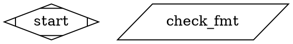

# CXDB Graph UI Spec — Critique v40 (opus)

**Critic:** opus (Claude Opus 4.6)
**Date:** 2026-02-25

## Prior Context

The v39 round addressed four issues from the opus critique. The shape-to-type mapping table in Section 7.3 was expanded from six to ten entries plus a default row (adding `circle`, `doublecircle`, `component`, `tripleoctagon`, `house`). An explicit `RunFailed` case was added to the `updateContextStatusMap` pseudocode. A default/fallback row was added to the shape-to-type table matching Kilroy's `default` case. A proposed holdout scenario was written for `RunFailed` with `node_id`. All four issues were fully addressed.

---

## Issue #1: The server's DOT parser does not mention DOT comment handling

### The problem

The spec's Section 3.2 describes the DOT parsing rules for `/dots/{name}/nodes` and `/dots/{name}/edges` in detail: quoted and unquoted attribute values, `+` concatenation, multi-line quoted strings, escape sequences, and subgraph scoping. However, it does not mention DOT comments.

DOT files support two comment styles:
- Line comments: `// comment text`
- Block comments: `/* comment text */`

Kilroy's DOT parser (`kilroy/internal/attractor/dot/comments.go`) strips both comment styles as a preprocessing step before lexing, taking care to preserve comment-like sequences inside double-quoted strings (e.g., `prompt="check http://example.com"` should not be treated as a line comment). The `stripComments` function handles:
1. `//` line comments (skips until newline, preserves the newline)
2. `/* */` block comments (skips until closing `*/`)
3. Both inside strings are NOT treated as comments (tracked via `inString` state and escape handling)

If the UI server's DOT parser does not strip comments, it will misparse DOT files containing comments. For example:



A parser that does not handle `//` could interpret `// Entry point` as part of the graph structure, producing a parse error or corrupted node data. A parser that does not handle `/* */` could fail on block comments entirely.

Kilroy-generated DOT files produced by the YAML-to-DOT compiler may not contain comments (the compiler generates clean DOT). But the spec states "Generic pipeline support" (Section 1.2) — the UI accepts any Attractor pipeline DOT file, and hand-edited or annotated DOT files commonly contain comments.

### Suggestion

Add a bullet point to the DOT parsing rules in Section 3.2 (alongside the existing rules for attribute syntax, multi-line values, etc.):

- **Comment handling:** The parser must strip DOT comments before parsing: `//` line comments (from `//` to end of line) and `/* */` block comments. Comments inside quoted strings are not stripped — the parser must track whether it is inside a double-quoted string and only recognize comment delimiters outside of strings.

## Issue #2: The `RunCompleted` turn lacks `node_id` and should not enter the status derivation, but this is not explicitly documented

### The problem

Section 5.4's turn type table correctly lists `RunCompleted` with fields `run_id, final_status` — no `node_id`. Kilroy's `cxdbRunCompleted` (`cxdb_events.go` line 163) confirms this: the event data map contains `run_id`, `timestamp_ms`, `final_status`, `final_git_commit_sha`, `cxdb_context_id`, and `cxdb_head_turn_id` but no `node_id`.

The `updateContextStatusMap` pseudocode (Section 6.2, line 1007) has the guard:

```
IF nodeId IS null OR nodeId NOT IN existingMap:
    CONTINUE
```

This correctly causes `RunCompleted` to be skipped (since `turn.data.node_id` is absent/null). However, the per-type rendering table in Section 7.2 includes `RunCompleted` as a displayable turn type with output column `data.final_status`. This creates an apparent contradiction: the status derivation skips turns without `node_id`, but the detail panel claims to render them.

The detail panel displays turns "filtered to those where `turn.data.node_id` matches the selected node's DOT ID" (Section 7.2). Since `RunCompleted` has no `node_id`, it will never match any node's filter and will never appear in the detail panel — making the `RunCompleted` row in the per-type rendering table dead code.

The same applies to `RunStarted` (which has `graph_name` but no `node_id` in its data), though `RunStarted` is not listed in the per-type rendering table. Other pipeline-level turns without `node_id` (`CheckpointSaved`, `Artifact`, `Blob`, `BackendTraceRef`) also fall through to the "Other/unknown" row but would never be displayed for the same reason.

### Suggestion

Add a clarifying note to the per-type rendering table or Section 7.2 explaining that pipeline-level turns without `node_id` (specifically `RunCompleted` and `RunFailed` without `node_id`) are never displayed in the per-node detail panel because the `node_id` filter excludes them. The `RunCompleted` and `RunFailed` rows in the table should note that they would only appear if the turn carries a `node_id` — which is the case for `RunFailed` (Kilroy always sets `node_id`) but never for `RunCompleted`. Consider removing the `RunCompleted` row from the per-type rendering table since it is unreachable, or explicitly marking it as "not displayed (no node_id)" to avoid confusing an implementer.

## Issue #3: The Definition of Done (Section 11) lists only six node shapes but the spec now documents ten

### The problem

The v39 revision expanded Section 7.3 to cover all ten Kilroy node shapes. However, the Definition of Done in Section 11 still reads:

```
- [ ] All node shapes render correctly (Mdiamond, Msquare, box, diamond, parallelogram, hexagon)
```

This lists only the original six shapes. An implementer checking off the Definition of Done would not verify `circle`, `doublecircle`, `component`, `tripleoctagon`, or `house`. The Definition of Done should be the authoritative checklist for implementation completeness, so it must match the spec's current shape inventory.

### Suggestion

Update the Definition of Done entry to:

```
- [ ] All node shapes render correctly (Mdiamond, Msquare, box, diamond, parallelogram, hexagon, circle, doublecircle, component, tripleoctagon, house)
```

This is a straightforward consistency fix.

## Issue #4: No holdout scenario covers a DOT file containing comments

### The problem

Given that DOT comment handling is not mentioned in the spec (Issue #1) and comments are a standard DOT language feature, there should be a holdout scenario ensuring the server's DOT parser handles comments correctly. Without this, an implementer could build a parser that works for all Kilroy-generated DOT files (which may lack comments) but fails on hand-edited DOT files with annotations.

### Suggestion

Add a holdout scenario such as:

```
### Scenario: DOT file with comments parses correctly
Given a DOT file contains line comments (// ...) and block comments (/* ... */)
  And a node attribute value contains a URL with // (e.g., prompt="check http://example.com")
When the browser fetches /dots/{name}/nodes
Then the comments are stripped and do not appear as node attributes or cause parse errors
  And the URL inside the quoted attribute value is preserved (not treated as a comment)
```
